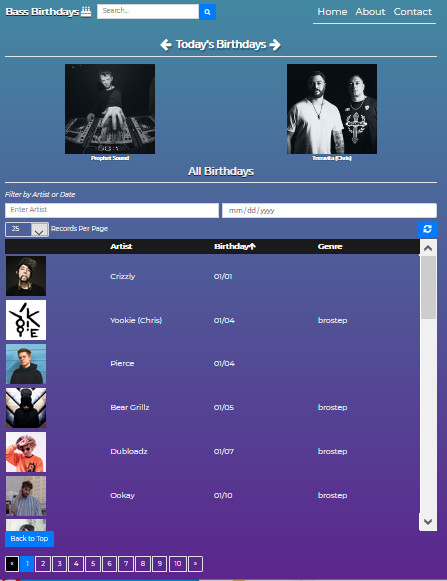
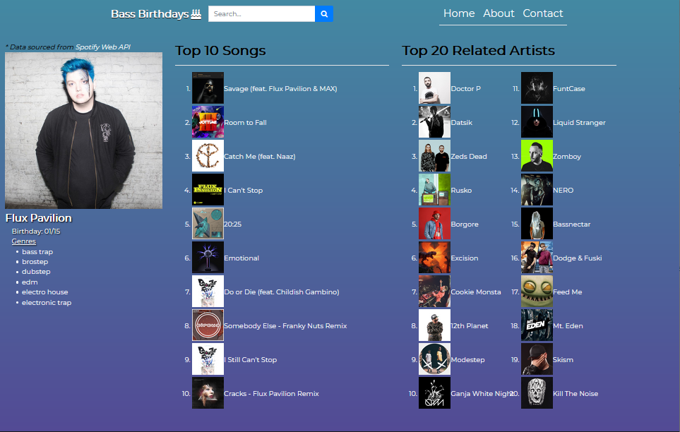

# Bass Birthdays
Bass Birthdays is a website dedicated to displaying the birthdays of artists involved in the bass music scene, whether that be a dubstep artist or future bass artist.

Each artist has their own profile. The data displayed on the website is sourced from Spotify's Web API.
<ul>
    <li>Displays the genres that are associated with their music</li>
    <li>Shows an artist's top 10 most popular songs<li>
    <ul><li>Each song can be clicked and will take the user to Spotify's website</li></ul>
    <li>Profiles also show 20 artists that make a similar style of music.</li>
        <ul><li>Each artist can be clicked and will take the user to their Spotify page</li></ul>
</ul>

# Motivation

The project was started with the intention of gaining a grasp on React, MongoDB, and REST APIs.
The idea behind the project was developed by a curiosity for birthdays of Artists in the Bass Music genre. 

# Built With
<ul>
<li>MongoDB - Database to store birthdays</li>
<li>ExpressJS - NodeJS framework </li>
<li>React - Javascript Library</li>
<li>Node - Javascript Runtime Environment</li>
</ul>

# Screenshots

Home Page   

Profile Page   

# Authors
Syed Haider
